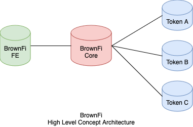
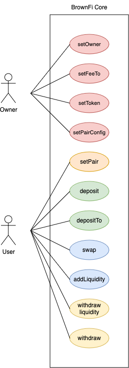
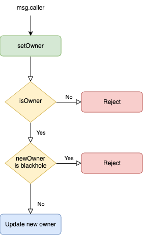
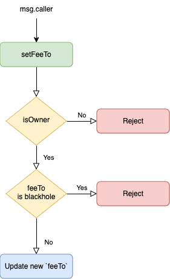
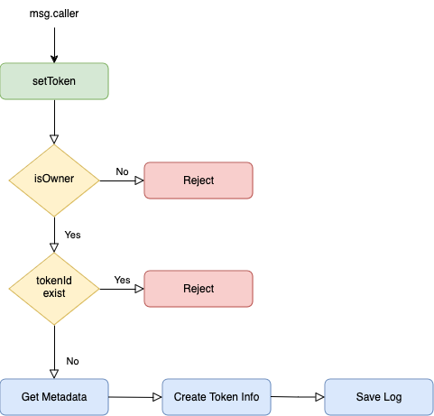
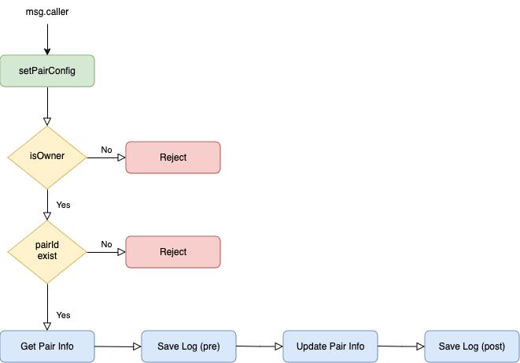
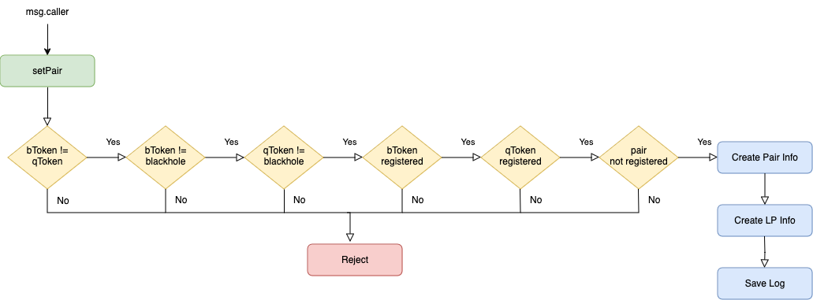
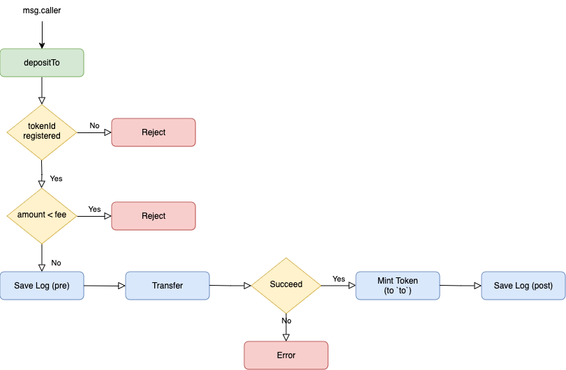

### High Level Architecture

  

### Use Case Diagram

  

### Flow Chart Diagrams

##### Set Owner

  

##### Set FeeTo

  

##### Set Token

  

##### Set Pair Config

  

##### Set Pair

  

##### Deposit

  

##### DepositTo

  

