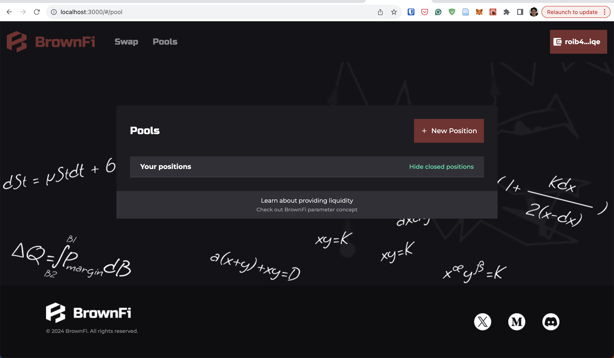

# BrownFi AMM Introduction

A novel AMM protocol with high CE & tailored market making strategies. We introduce a novel price discovery mechanism called `Elastic PLOB` to customize CE & market making on AMM, while maintaining a simple UX, fungibility, and reusability of LP tokens from Uniswap v2.

For more information, please check the [BrownFi Introduction](https://github.com/BrownFi/BrownFi-AMM-ICP/blob/main/BrownFi.md)



## Installations

- `Nodejs` (v18.4.0 or newer): Download it [here](https://nodejs.org/en/download)
- `dfx` CLI tool: Please follow the instruction to install it [here](https://internetcomputer.org/docs/current/developer-docs/getting-started/install/)

## Experimental Running (local)

- Clone this repository:

```bash
git clone https://github.com/BrownFi/BrownFi-AMM-ICP.git brownfi-amm
cd brownfi-amm
```

- Local running

```bash
##### BrownFi AMM Core Canister #####

# Start the replica and run in the background
dfx start --clean --background

# Create identities using in the demo
dfx identity new alice --storage-mode plaintext
dfx identity new bob --storage-mode plaintext
dfx identity new owner --storage-mode plaintext
dfx identity use owner

# Run the demo script file
./demo.sh

##### BrownFi AMM Front-end Canister #####

# Install dependencies
npm install

# Build front-end
npm run build

dfx deploy
```

After completion, your output will appear similar to the following:

```bash
Deployed canisters.
URLs:
  Frontend canister via browser
    frontend: http://127.0.0.1:8080/?canisterId=avqkn-guaaa-aaaaa-qaaea-cai
  Backend canister via Candid interface:
    core: http://127.0.0.1:8080/?canisterId=bd3sg-teaaa-aaaaa-qaaba-cai&id=be2us-64aaa-aaaaa-qaabq-cai
    router: http://127.0.0.1:8080/?canisterId=bd3sg-teaaa-aaaaa-qaaba-cai&id=bkyz2-fmaaa-aaaaa-qaaaq-cai
    token0: http://127.0.0.1:8080/?canisterId=bd3sg-teaaa-aaaaa-qaaba-cai&id=br5f7-7uaaa-aaaaa-qaaca-cai
    token1: http://127.0.0.1:8080/?canisterId=bd3sg-teaaa-aaaaa-qaaba-cai&id=bw4dl-smaaa-aaaaa-qaacq-cai
```
